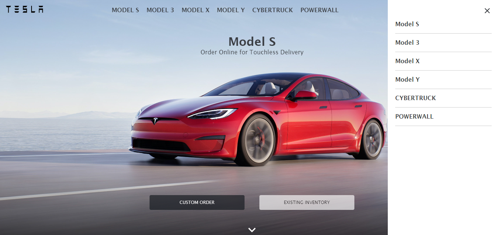

# Tesla Clone

## Project Create With React App and Redux

This project was bootstrapped with [Create React App](https://github.com/facebook/create-react-app), using the [Redux](https://redux.js.org/) and [Redux Toolkit](https://redux-toolkit.js.org/) template.

## Description

This project is a clone of Tesla's home page, created to replicate its user interface. It is styled using Styled Components, a library that allows writing styles directly into React components, making design development and maintenance easier. Additionally, React Reveal has been implemented for animations that enhance the presentation of the components, providing an attractive visual experience. Redux, Redux Toolkit have also been used, adding global state management, efficient tools for Redux and pre-established interface components respectively. The design highlights with a drop-down menu for a better user experience.

## Characteristics

* Replica of the Tesla home page for a familiar interface.
* Styling with Styled Components for easier management of styles in React components.
* React Reveal implementation for animations that enhance the presentation.
* Use of Redux, Redux Toolkit to manage global state and interface components.

## Screenshots




## Install

Clone this repository:

```bash
git clone https://github.com/Chencho34/tesla-clon
``` 
Install the dependencies:

```bash
npm install
```

## Execute Project

```bash
npm start
```

Runs the app in the development mode.\
Open [http://localhost:3000](http://localhost:3000) to view it in your browser.

The page will reload when you make changes.\
You may also see any lint errors in the console.

## Author

Developer: Chencho34

## Librerias Implementadas:

* [React reveal](https://www.react-reveal.com/)
* [Styled components](https://styled-components.com/).
* [Material UI](https://mui.com/material-ui/getting-started/installation/).
* [Redux](https://redux.js.org/).
* [Redux Toolkit](https://redux-toolkit.js.org/).


